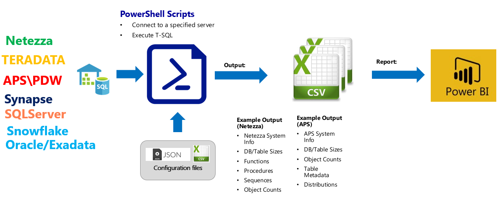
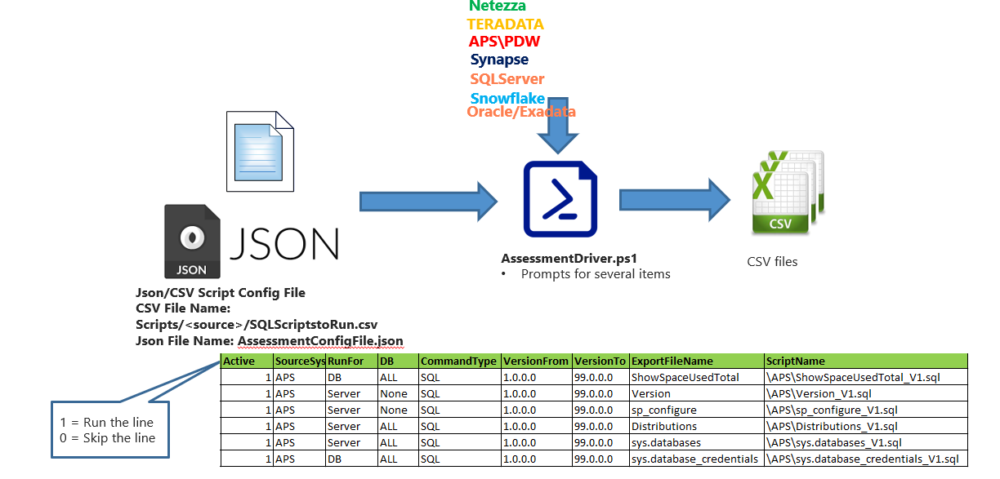
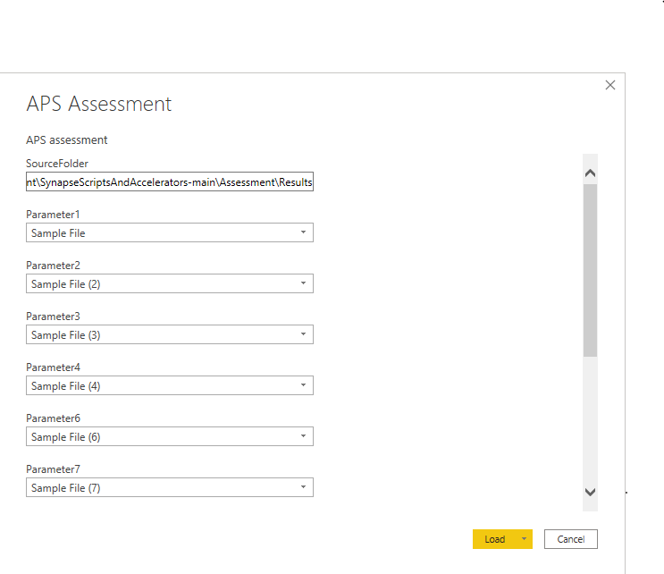
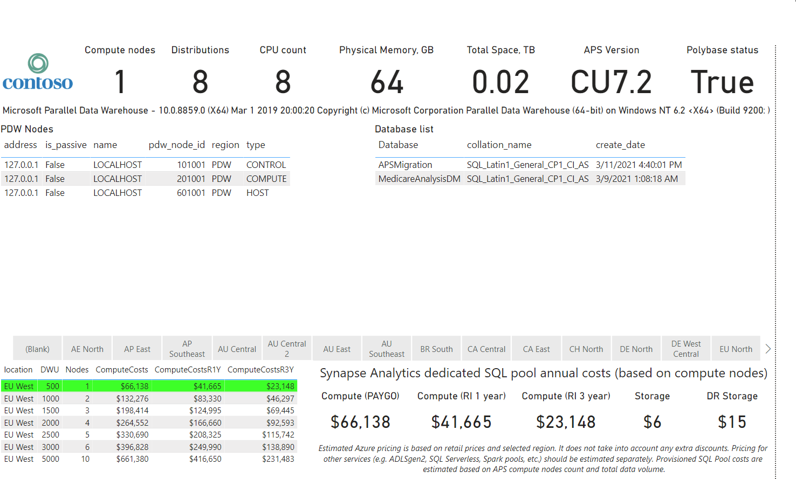

# **Table Of Contents**
 - [Assessment Tool Summary](#assessment-tool-summary) 
 - [Assessment Tool Dataflow](#assessment-tool-dataflow)
 - [Prepartion Tasks](#prepartion-tasks)
 - [How to run the Assessment Tool](#how-to-run-the-assessment-tool)
 - [PowerBI Report Generation](#powerbi-report-generation)
 - [Appendix](#appendix)
 - [Contact Information](#contact-information)


## Assessment Tool Summary
Assessment tool is used to gather information on the Source System DBs to better enable an accurate estimate for the migration.

| **Supported Source Systems**    | **Benefits**                  | **Tool details**  | **Capturing Information** |
| ------------------------------------------------------------ | ------------------------------------------------------------ |------------------------------------------------------------ |------------------------------------------------------------ |
|<ul><li>APS</li><li>SYNAPSE</li><li>Teradata</li><li>SQLServer</li><li>SNOWFLAKE</li><li>SNOWFLAKE</li><li>NETEZZA</li><li>ORACLE/Exadata</li></ul> |<li>Source System inventory to migrate​</li><li>Scoping the migration effort with consolidated reports​</li><li>Generation of Power BI report​</li><li>Ability to add additional inventory queries​</li><li>Supports data gathering at different levels(ex: Server, DB level and table level)​</li><li>Supports different authentication types (ex: ADPass, AzureADInt, WinInt, SQLAuth)</li> |<li>Easy to configure and run​</li><li>Built on Powershell scripts​</li><li>Supports multiple iterations to run​</li><li>**Steps to execute:** ​</li><li>**Step 1** – Assessment driver execution​</li><li>**Step 2** -  PowerBI report generation​</li><li>**Input:** ​</li><li>Source System details​</li><li>Ex: DB server,port,username & password​</li><li>**Output:** ​</li><li>CSV files with the source system inventory details</li>|<li>DB Version​</li><li>Object Count​</li><li>Object Metadata(Size, partitions count, distribution type, distribution column, etc.)​</li><li>Size of the System​</li><li>Users & schema information</li> |

## Assessment Tool Dataflow



## Prepartion Tasks

**1.Download the repository to the local folder (ex: C:\Migration_Assessment)**

Refer [Download from browser](https://www.wikihow.com/Download-a-GitHub-Folder)

**2.Environment Setup**
Powershell may expect you to setup the execution policies. You can follow one of the below options.
*[Please refer this URL for the execution policy details](https://docs.microsoft.com/en-us/powershell/module/microsoft.powershell.security/set-executionpolicy?view=powershell-7.1)*

**Example policy setup:**

1. You can bypass the execution policy at the session level by running the below command on the powershell prompt
```
   Set-ExecutionPolicy -Scope Process -ExecutionPolicy Bypass

```
**or**

2. If you are not allowed  to change the execution policy from a global domain policy then you can have the workaround by executing the below commands.
```
Unblock-File -Path .\AssessmentDriver_V2.ps1
Unblock-File -Path .\RunSQLStatement.ps1
```

**or**

3. You can have work around by creating the temp files
```
- Rename AssessmentDriver_V2.ps1 as temp_ AssessmentDriver_V2.ps1
- Create a new/blank file AssessmentDriver_V2.ps, then copy over  the content of temp_ AssessmentDriver_V2.ps1
- Save AssessmentDriver_V2.ps 
- Delete temp_ AssessmentDriver_V2.ps1
- Repeat the same steps for RunSQLStatement.ps1 and then run .\AssessmentDriver_V2.ps1
```

**3.Configuration & script details (this is an optional step)**

**Note :** Please don't change any configuration files unless it is required to be changed. Please refer the [Configuration & Scripts Information](Readme_References/Configuration_Scripts_details.md)

## How to run the Assessment Tool

The program processing logic and information flow is illustrated in the diagram below: 



**Steps to execute the Assessment tool:**

- Download the repository and navigate it to the  to the Assessment folder. Please refer [Prepartion Tasks](#prepartion-tasks) section.
- Run the Assessment tool by executing the **AssessmentDriver_V2.ps1** on Powershell prompt.

**Example:**
```
PS C:\Migration_Assessment\SynapseScriptsAndAccelerators-main\Assessment> .\AssessmentDriver_V2.ps1
Mode                 LastWriteTime         Length Name
----                 -------------         ------ ----
d-----         4/16/2021  10:48 AM                logs
Enter the name Source System Type to connect to(SQLServer, APS, SYNAPSE, TERADATA, NETEZZA, SNOWFLAKE). Default on Enter: [Synapse]: APS
Would you like to filter the Database to Inventory. % = All DBs or dbname,dbname delimited.  Default on Enter: [%]:
Enter the name/ip of the Server to connect to. Default on Enter: [testserver.sql.azuresynapse.net]: testaps.centralus.cloudapp.azure.com,17001
How do you want to connect to the DB (ADPass, AzureADInt, WinInt, SQLAuth). Default on Enter: [SQLAUTH]?:
SQLAUTH Method used. Please Enter the UserName: testuser
Password:: **************

```
***This will prompt for the following Information: Default values get picked up from AssessmentConfigFile.json. Once the details are provided then it updates the configuration file***

* **Source System Type:**  Provide the source database type from the supported systems.
* **Database filter:** Provide the list of databases for the assessment summary(Recommendation is to go with default option% for all the databases)
* **name/ip of the Server:** Source Database server to connect

* **How do you want to connect to the DB (ADPass, AzureADInt, WinInt, SQLAuth)?** – When connecting to the source system, what method should be used to connect to the DB?

  * Default: SQLAuth
    * SQLAuth – Use a Source system (APS/SQLDW/Netezza/Teradata) username and password.  Teradata/Netezza – only method tool connects to these sources
    * ADPass – Use Azure AD to authenticate and supply the AD username and Password – AzureDW only
    * AzureADInt – Use Azure AD to authenticate and connect to the DB – AzureDW only
    * WinInt – Use Windows AD authentication to connect to the Source Server. – APS only

  - If ADPASS or SQLAUTH is used to connect to the source DB.
    - “**(ADPass/SQLAuth Method used. Please Enter the UserName.**” – User name with permission run the scripts“
    - "**Password**:” – Enter the password for the username entered above

## PowerBI Report Generation
Once assessment tool output data is available, you can use the template located under the PowerBI folder to generate an assessment report. 
At this time PowerBI dashboards are created for these source: APS, SQL Server, Oracle and Teradata (limited output).
Open Power BI template and specify the source folder where assessment output files reside(Example: C:\Migration_Assessment\SynapseScriptsAndAccelerators-main\Assessment\Results)

**Please note, for missing or empty assessment files:** 

If assessment outputs do not contain any data (e.g. triggers, partitions), disable the file(s) for loading. 
Click on the "Transform Data" icon, locate the file/feed on the left pane (e.g. Triggers or Table Partitions), right click, and uncheck "Enable Load". Save and Refresh the PowerBI dashboard.

**APS PowerBI template Input sample**



**APS PowerBI report sample**




## Appendix

- [Assessment Tool powerpoint](AssessmentTool.pptx)
- [PowerBI template](./PowerBI/SQLServer/SQL%20Server%20Assessment.pbit)
- [Sample APS Assessment tool execution screenshot](..//Images/0A_assessment_execution.PNG)
- [APS or Synapse Assessment Capturing Information](Readme_References/APS_or_Synapse_CapturingInformation.md)
- [Netezza Assessment Capturing Information](Readme_References/Netezza_CapturingInformation.md)
- [Netezza Schema export details](Readme_References/Netezza%20Schema%20Extract.md)
- Additional PowerBI sample reports
  - APS Sample reports
    - [Report](..//Images/0B_Sample_APS_powerBI_report.PNG)
    - [Report1](..//Images/0B_Sample_APS_powerBI_report1.PNG)


## Contact Information
Please send an email to AMA architects at <AMAArchitects@service.microsoft.com> for any issues regarding this tool.