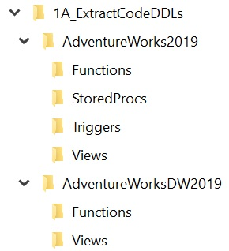
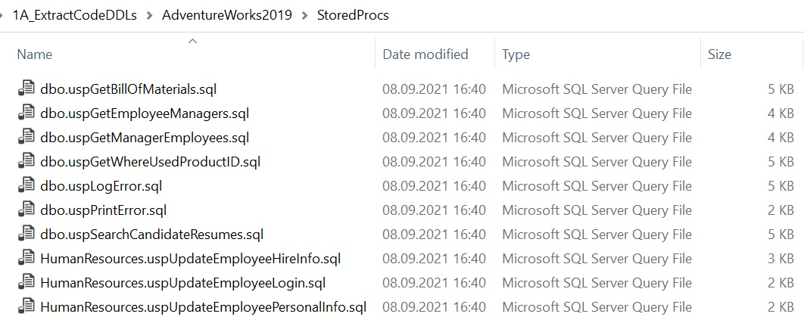

# **Module 1A_ExtractCodeDDLs** 

Use module **1A_ExtractCodeDDLs** to extract DDL scripts for SQL Server code objects, including View, Functions, Triggers, and Stored Procedures. DDL scripts are stored in target .sql files.

You need to run **ExtractCodeDDLs.ps1** script which will prompt you for the following configuration information:

1. **DatabasesList.csv** - this CSV file specifies the list of databases from which code object DDLs will be extracted.
2. **ExtractCodeDDLs_config.json** - this JSON file specifies SQL Server connectivity information, including SQL Server instance name, IntegratedSecurity option, and Output files folder path.
3. (Optional) - user name and password if SQL authentication was specified (IntegratedSecurity=NO in config file, see below).

> ##### **Note**
>
> Configuration files are expected to be in the same folder where PowerShell script resides.

The definition and sample values for each row in **ExtractCodeDDLs_config.json** file are described in below table:

| Parameter          | Description                                                  | Sample Values                                          |
| ------------------ | ------------------------------------------------------------ | ------------------------------------------------------ |
| ServerName         | SQL Server instance name. Any format will work as long as connection can be established from the machine where PowerShell script is executed.  Note that slash characters should be doubled due to JSON format. | SQLServerHostName\\\InstanceName  or SQLServerHostName |
| IntegratedSecurity | YES or NO for IntegratedSecurity                             | YES or NO                                              |
| OutputFolder       | Full folder path where the extracted DDL scripts will be stored. Note that slash characters should be doubled due to JSON format. *Both absolute and relative paths are supported.* | ..\\\Output\\\1A_ExtractCodeDDLs                       |

The definition and sample values for each column in **DatabasesList.csv** are described in below table:

| Column         | Description                       | Sample Values        |
| -------------- | --------------------------------- | -------------------- |
| Active         | 1 – Use record,  0 – Skip record. | 0 or 1               |
| SourceDatabase | Database Name                     | AdventureWorksDW2019 |

Sample script output is depicted below.

Extracted DDL scripts will be stored under Output folder and structured by respective database name and object type (View, Functions, Stored Procedures, Triggers).

#### **Important notes**

- PowerShell script requires PowerShell version 5.1 or higher and **SqlServer** module. If these prerequisites are not met the script will fail immediately and report missing prerequisites.
- Configuration files are expected in the same folder where the script is located.
- DDL scripts are extracted AS IS without any changes at this point.
- DDL scripts are extracted using **sys.sql_modules** system catalog view. Hence, all comments and formatting is preserved.
- As triggers are not supported in Azure Synapse, triggers DDL scripts are extracted for reference purposes and can be used for manual migration.
- If output folder is not empty existing files will be overwritten in case of file name match.

