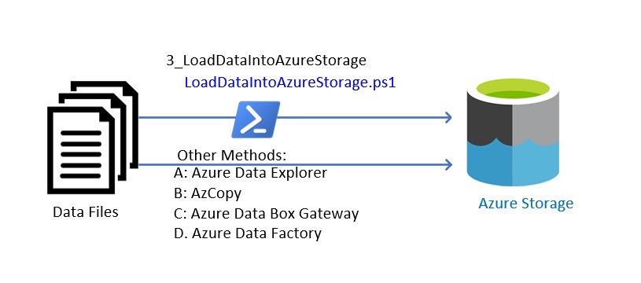

# **Module 3_LoadDataIntoAzureStorage**

Use module **3_LoadDataIntoAzureStorage** to copy data from on-prem storage to Azure Storage. The function is illustrated in the figure below:

You need to run **LoadDataIntoAzureStorage.ps1** which will prompt you for the names of one configuration file: **upload_config.json**.

The definition and sample values for each row of the **upload_config.json** file s described in below table:

| Parameter Name           | Description                                                  | Values (Sample)                                              |
| ------------------------ | ------------------------------------------------------------ | ------------------------------------------------------------ |
| AzCopyPath               | Location where AzCopy is  installed                          | C:\\Z_Progs\\AzCopy10                                        |
| AzureSubscriptionID      | Your Azure Subscription ID                                   | You can find out this value from  Azure Portal if you have access to an Azure Subscription. It looks like this:  abcxyz-123bn-bayn49gw-stuff-01234 |
| AzureResourceGroup       | Azure Resource Group for the  Azure Storage where you’d like to upload files into. | From Azure portal you can find  the resource group that contains the Azure Storage Account. |
| StorageAccountName       | Azure Storage Account Name                                   | From Azure portal you can your  Azure Storage Account Name.  |
| GenerateSASKey           | Specify “Yes” or “Y” if you’d  like a SAS key to be generated. If Yes, you will be prompted to login into  your Azure account. | “Yes” or “Y”. Any other values  will be converted to “No”.   |
| SASKey                   | Provide your own SAS key if the  answer to above “GenerateSASKey” is not Yes. | This is the SAS key generated by  Azure. Very long string.   |
| KeyExpirationTimeInHours | Specify how long the SAS key  will be valid (in hours) if you’d like the SAS key be generated. | Positive Integer                                             |
| ContainerName            | Your Azure Storage Container  Name where you’d like the files to be uploaded into. |                                                              |
| FoldersToUpload          | Specify a list of local folders.  One or more folders can be specified. Separated by comma. | ["C:\\migratemaster\\output\\2_ExportSourceData\\Folder1",  "C:\\migratemaster\\output\\2_ExportSourceData\\Folder2] |

Below are some alternative methods to move data from your on-prem local storage to Azure Storage (Azure Data Lake Store or Blob Storage):

A.  Azure Data Explorer - [What is Azure Data Explorer? | Microsoft Docs](https://docs.microsoft.com/en-us/azure/data-explorer/data-explorer-overview#:~:text=What is Azure Data Explorer%3F 1 Data warehousing,Azure Data Explorer. ... 3 Query experience. )

B.  Use AzCopy - [azcopy | Microsoft Docs](https://docs.microsoft.com/en-us/azure/storage/common/storage-ref-azcopy)

C.  Azure Data Box Gateway - [Microsoft Azure Data Box Gateway overview | Microsoft Docs](https://docs.microsoft.com/en-us/azure/databox-gateway/data-box-gateway-overview)

D.  Azure Data Factory -  [Azure Data Factory Documentation - Azure Data Factory | Microsoft Docs](https://docs.microsoft.com/en-us/azure/data-factory/)

